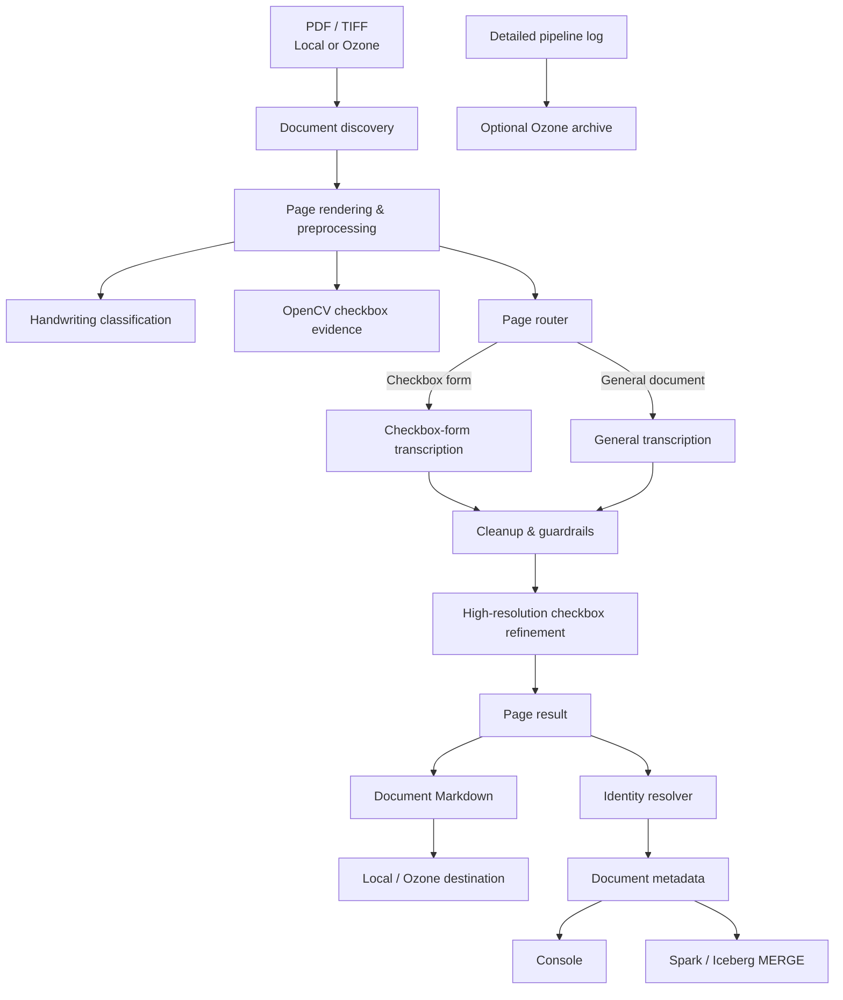

# Clinical Document Processor

A multi-pass clinical document transcription and triage pipeline for scanned **PDF and TIFF** documents. It combines a vision-language model (VLM), OpenCV-based checkbox detection, patient identity extraction, local or Apache Ozone storage, and optional Apache Iceberg metadata persistence.

The pipeline is designed for clinical documents containing a mix of printed text, handwriting, checkboxes, tables, and multi-page content. Instead of treating every page as a generic OCR task, it uses page-aware routing, dedicated checkbox-state refinement, transcription guardrails, review flags, and document-level metadata.

> **Security:** This pipeline may process sensitive clinical information. Do not commit patient documents, generated PHI, production credentials, access tokens, internal endpoints, or private certificates to source control.

## Highlights

- PDF, TIFF, and multi-page TIFF processing
- Page-by-page VLM transcription
- Handwriting classification: `None`, `Low`, `Heavy`
- Content-aware page routing
- OpenCV checkbox detection
- Conservative checked-state extraction
- Checkbox hallucination and repetition guardrails
- Patient name, DOB, and MRN metadata extraction
- Local filesystem or Apache Ozone S3 Gateway I/O
- Console and/or Spark Iceberg metadata sinks
- Batch Iceberg upserts
- Per-page failure isolation
- Optional detailed pipeline-log archival to Ozone
- CLI and notebook execution paths

## Architecture



The implementation separates storage, rendering, routing, transcription, checkbox refinement, identity resolution, Markdown generation, metadata persistence, and logging. This keeps extracted text independent from operational metadata and makes the processing path easier to inspect and troubleshoot.

## Processing flow

### 1. Discover documents

The configured source is scanned recursively for supported extensions.

The current configuration supports:

```text
.pdf
.tif
.tiff
```

Hidden paths are skipped.

### 2. Parse filename metadata

Filenames are split on `_`.

For example:

```text
123456_EXTREF_referral.pdf
```

is interpreted as:

```text
MRN           = 123456
Document type = EXTREF
Extension     = .pdf
```

The first filename token becomes the filename-derived MRN. The first token matching a configured document type becomes the document type. If no configured type is found, the type is recorded as `UNKNOWN`.

### 3. Render each page

PDF pages are rendered with PyMuPDF.

TIFF files are handled frame-by-frame with Pillow. Multi-page TIFFs are explicitly supported by seeking to and copying each frame independently.

Three rendering resolutions are configurable:

| Setting | Purpose |
|---|---|
| `res_judge_px` | handwriting classification |
| `res_transcribe_px` | routing and base transcription |
| `res_refine_px` | high-resolution checkbox refinement |

The transcription path applies flat-field normalization and CLAHE contrast enhancement before VLM inference.

### 4. Classify handwriting

A lightweight VLM pass classifies every page as:

```text
None
Low
Heavy
```

Pages classified as `Heavy` are flagged for review.

### 5. Detect checkbox evidence

OpenCV detects checkbox-like square contours.

This visual evidence is used to:

- estimate checkbox density,
- help route the page, and
- identify regions for high-resolution checkbox refinement.

OpenCV is not used as the final source of truth for checked state.

### 6. Route and transcribe the page

When `page_router_enabled: true`, the VLM router classifies the page as one of:

```text
checkbox_form
clinical_note
table_report
mixed
unknown
```

The route is combined with visual checkbox counts.

Checkbox-heavy pages use the checkbox-oriented prompt. Notes, reports, tables, and other pages use the general-document prompt.

For checkbox-form pages, all checkbox options begin as neutral:

```text
[ ] Option label
```

The base transcription does **not** decide whether a checkbox is checked.

### 7. Apply transcription guardrails

The implementation checks for suspicious output such as:

- generated checkbox counts far above visual checkbox evidence,
- excessive markdown-to-visual checkbox ratios,
- large checkbox-count gaps, and
- repeated or loop-like transcription output.

When configured, suspicious checkbox-oriented output is retried with the general-document prompt.

### 8. Refine checkbox state

Checkbox pages with valid checkbox targets are rendered again at high resolution.

The VLM is asked to return **only visibly checked boxes**. Returned labels are mapped back to transcription targets using normalized text similarity and section context.

Only positively matched options are changed from:

```text
[ ] Option
```

to:

```text
[x] Option
```

Unconfirmed boxes remain unchecked.

### 9. Resolve patient identity

After page extraction, an optional metadata-only resolver extracts:

- patient name,
- date of birth,
- MRN,
- confidence,
- supporting evidence,
- conflicts, and
- manual-review requirement.

The resolver does not modify page transcription.

If an MRN was parsed from the filename, the filename MRN takes precedence over an MRN extracted from document text.

### 10. Write output and metadata

The transcription is written as Markdown.

Operational and identity metadata are emitted separately to the configured metadata sink.

A failed page does not discard successfully processed pages from the same document.

## Repository layout

Recommended structure:

```text
clinical-document-processor/
├── README.md
├── requirements.txt
├── .gitignore
├── src/
│   └── clinical_document_processor.py
├── config/
│   └── config.example.yaml
└── notebooks/
    └── clinical_document_processor.ipynb
```

The Python script should be treated as the primary CLI/runtime implementation. The notebook is an interactive companion for development and controlled execution.

## Prerequisites

### Vision-language model endpoint

The pipeline expects an OpenAI-compatible chat-completions endpoint capable of accepting image input.

The supplied configuration uses:

```text
Qwen/Qwen2.5-VL-7B-Instruct
```

### CDP CLI

Model authentication is generated at runtime with:

```bash
cdp iam generate-workload-auth-token \
  --workload-name <WORKLOAD_NAME> \
  --profile <CDP_PROFILE>
```

The token is cached for the process. If a model request returns HTTP `401`, the pipeline refreshes the token and retries once.

### Python libraries

The implementation imports:

| Capability | Import |
|---|---|
| numerical processing | `numpy` |
| YAML | `yaml` |
| HTTP | `requests`, `urllib3` |
| S3 / Ozone | `boto3`, `botocore` |
| PDF rendering | `fitz` |
| image processing | `cv2` |
| TIFF handling | `PIL` |
| Spark | `pyspark` |
| Cloudera data connection | `cml.data_v1` |

Spark and Cloudera runtime libraries may already be supplied by the Cloudera AI/CML environment. The implementation targets Spark 3.3 for Iceberg metadata writes.

### Iceberg metadata sink

If `metadata_sink` includes `spark_iceberg`, the runtime needs:

- a valid Cloudera AI data connection,
- a working Spark session,
- an Iceberg catalog/table configuration, and
- support for the `MERGE INTO` operation used by the pipeline.

## Configuration

Runtime behavior is controlled by YAML.

The configuration loader is strict: unknown fields are rejected and required fields must be present.

Keep a sanitized example in Git:

```text
config/config.example.yaml
```

Create the real runtime configuration separately:

```bash
cp config/config.example.yaml config/config.yaml
```

Do not commit `config/config.yaml`.

Major configuration groups include:

| Group | Examples |
|---|---|
| Model | endpoint, model name, timeout, temperature, max tokens |
| CDP authentication | workload name, CLI profile, TLS settings |
| Storage | local/Ozone source and destination |
| Ozone | S3G endpoint, access key, secret key, signing, addressing |
| TLS | model and Ozone certificate verification |
| Metadata | console, Spark Iceberg, or both |
| Rendering | judge, transcription, and refinement resolutions |
| Checkbox processing | thresholds, bands, overlap, label matching |
| Page routing | router enablement and checkbox thresholds |
| Guardrails | checkbox explosion and repetition detection |
| Identity | resolver enablement and limits |
| Logging | console behavior and Ozone log archival |
| Inputs | supported document types and file extensions |

For Ozone, source and destination roots use:

```text
bucket/optional/prefix
```

Primary metadata sink values are:

```text
console
spark_iceberg
both
```

## Running the pipeline

From the repository root:

```bash
python src/clinical_document_processor.py \
  --config config/config.yaml
```

The CLI requires the `--config` argument.

At completion it prints:

```text
Processed <N> document(s).
```

The core pipeline function can also be called directly when the module is available on the Python path:

```python
results = run_pipeline("config/config.yaml")
```

`run_pipeline()` returns a list of document-level metadata dictionaries.

## Output

### Markdown

Each source document produces one Markdown file derived from the source basename.

Example:

```text
123456_EXTREF_referral.pdf
```

becomes:

```text
123456_EXTREF_referral.md
```

The generated structure is:

```markdown
# 123456_EXTREF_referral.pdf

## Page 1

*handwriting: Low · checkboxes: 12*

<transcribed page content>

## Page 2

*handwriting: None · checkboxes: 0*

<transcribed page content>
```

The full document metadata record is not written as Markdown front matter.

### Metadata

Document metadata includes:

```text
document_type
source_document_name
source_document_location
destination_file_location
num_pages
digital_native
status
review_remarks
created_dt
updated_dt
patient_name
patient_dob
patient_mrn
patient_mrn_source
patient_identity_confidence
patient_identity_review_required
patient_identity_evidence
patient_identity_conflicts
```

## Spark Iceberg metadata

When enabled, metadata is collected in batches and merged into an Iceberg table.

If configured, the pipeline can create the table automatically.

The generated table uses:

- Iceberg format version 2,
- Zstandard Parquet compression, and
- bucket partitioning on `source_document_name`.

Metadata is upserted with:

```sql
MERGE INTO <table> AS t
USING <staging_view> AS s
ON t.source_document_name = s.source_document_name
```

Existing records are updated and new records are inserted.

`source_document_name` is therefore the logical metadata upsert key.

## Logging and observability

The pipeline logs:

- configuration summary,
- source discovery,
- document and page progress,
- handwriting classification,
- checkbox evidence,
- transcription routing,
- checkbox refinement,
- metadata summaries,
- warnings, and
- failures.

For large runs:

```yaml
console_summary_only: true
```

keeps console output compact while preserving warnings, errors, and explicit progress messages.

When Ozone log archival is enabled, the detailed run log is written to a temporary local file and uploaded to the configured Ozone log location.

Log files use:

```text
<log_file_prefix>_<UTC timestamp>.log
```

If upload succeeds, the temporary file is deleted. If upload fails, it is retained for troubleshooting and the extraction result is not changed.

## Review and failure behavior

### `ready`

The document completed with no review remarks.

### `review`

The document completed, but one or more review conditions were raised.

Examples include:

- heavy handwriting,
- checkbox count above the configured threshold,
- `[illegible]` output,
- transcription-guard activity, or
- page-level processing errors.

### `error`

A document-level exception prevented normal processing.

The batch continues with subsequent documents.

### Page isolation

A page-level exception does not stop the rest of the document.

The failed page is represented as:

```text
[page processing error]
```

and the document receives a corresponding review remark.

## Important implementation notes

### Digital-native PDFs

The pipeline detects whether a PDF has an extractable text layer and records the result as:

```text
digital_native
```

This is currently a probe only. Digital-native PDFs still follow the VLM transcription path.

### Multi-page TIFFs

TIFF frames are selected using direct `seek()` and copied before conversion, avoiding mutable frame reuse across pages.

### Checkbox refinement

The high-resolution checkbox pass uses the raw rendered image rather than the contrast-enhanced transcription image.

Checked labels are mapped back to known checkbox targets using normalized text similarity and section context.

### Identity resolution

Identity extraction is metadata-only.

The filename MRN wins when present. Document-text MRN is used only when a filename MRN is unavailable.

Missing identity fields or reported conflicts require identity review.

### Strict configuration

Startup fails when:

- the config file does not exist,
- the YAML root is not a mapping,
- an unknown config field is supplied,
- a required field is missing,
- no supported extensions are configured, or
- no supported document types are configured.

## Security and deployment considerations

Do not commit:

```text
config/config.yaml
.env
*.env
patient documents
generated transcriptions containing PHI
production logs containing PHI
credentials
access tokens
private keys
```

A typical `.gitignore` should also include:

```gitignore
.DS_Store
__pycache__/
*.py[cod]
.venv/
venv/
.ipynb_checkpoints/
*.log
output/
```

The implementation allows TLS verification to be disabled independently for the model endpoint, CDP CLI, and Ozone. Production deployments should use certificate verification and trusted CA bundles whenever possible.

This pipeline is designed for transcription, extraction, metadata generation, and review triage. Model-generated output should be validated according to the requirements of the environment before downstream clinical or research use.

---

## Design principles

The implementation is built around a few core principles:

- process documents page by page,
- route pages according to content,
- separate checkbox detection from checked-state determination,
- keep uncertain checkbox states conservative,
- flag ambiguous extraction for review,
- keep transcription separate from metadata,
- isolate page failures,
- preserve operational lineage and logs, and
- support both local development and Ozone/Iceberg deployment.
